# RK S98 Spotify Display

Aplicación para **macOS** que muestra la pista actual de Spotify en la pantalla TFT de un Royal Kludge RK-S98. El firmware sigue siendo el original: el dial, los menús, el RGB, el volumen y el teclado continúan funcionando.

<p>
  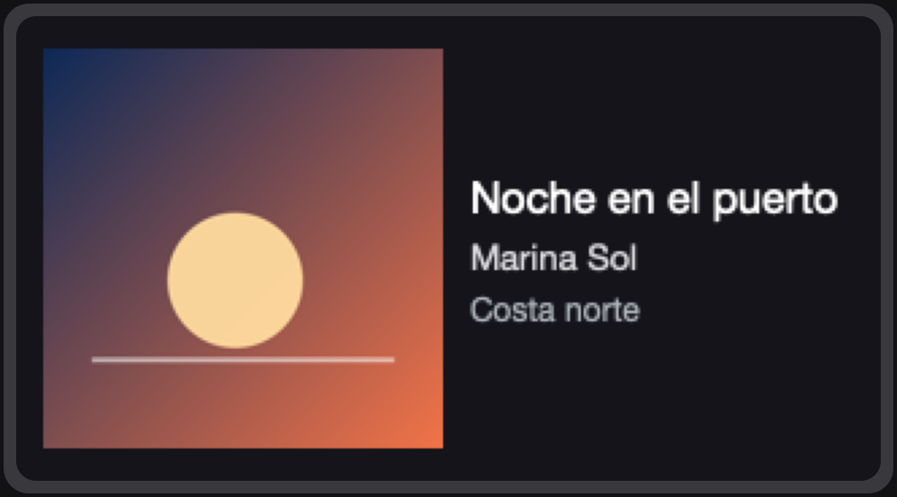
</p>

Así se compone cada pista: carátula a la izquierda y, a la derecha, título, artista y álbum. El archivo mide **320×172** píxeles. En la foto, ese mismo archivo está colocado en la TFT de la unidad con la que se desarrolló el proyecto.

<p>
  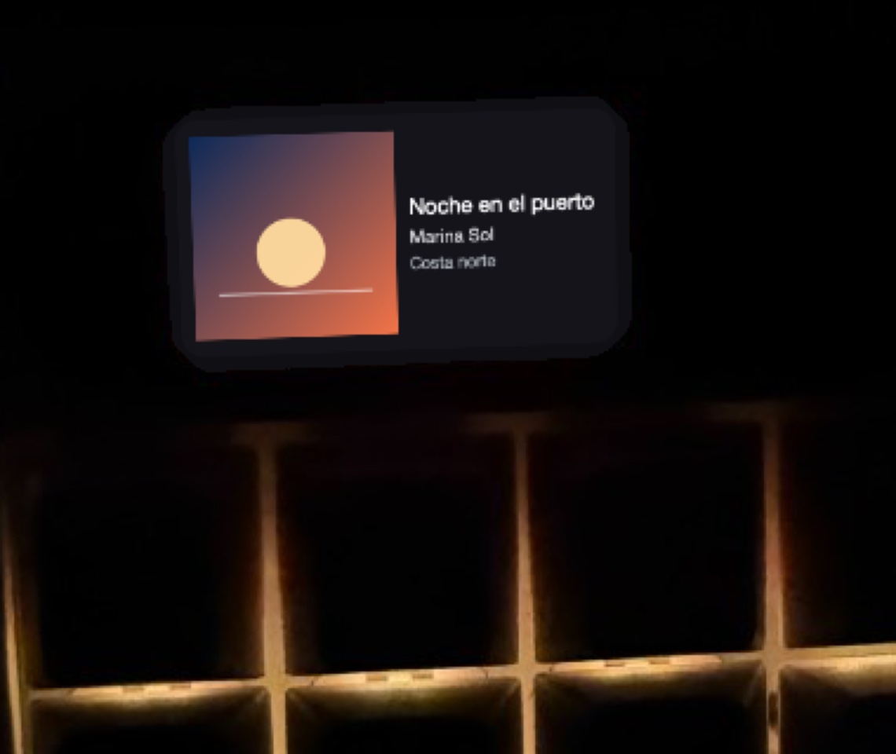
</p>

La aplicación vive en la barra de menús, junto al volumen y la batería. El icono es una nota musical. El menú muestra la pista y **Salir**.

<p>
  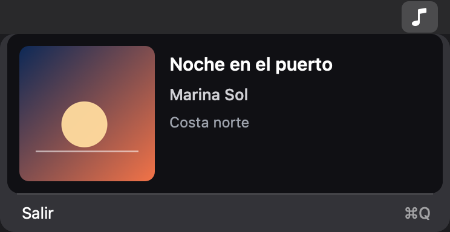
</p>

## Qué hace

1. Lee la pista desde la aplicación de escritorio de Spotify, en el Mac.
2. Compone una imagen fija con la carátula y el texto.
3. La envía a la pantalla del teclado cuando la pista cambia.
4. Deja de hablar con la pantalla hasta el siguiente cambio.

No hay barra de progreso de la canción, ni animación, ni un fotograma por segundo. Cada subida envía 215 bloques. En esta unidad tardó unos **13 segundos**. Mientras tanto, el menú muestra el porcentaje de esa subida, que es el avance del envío.

| Reproduciendo | Subiendo la imagen |
| --- | --- |
|  | 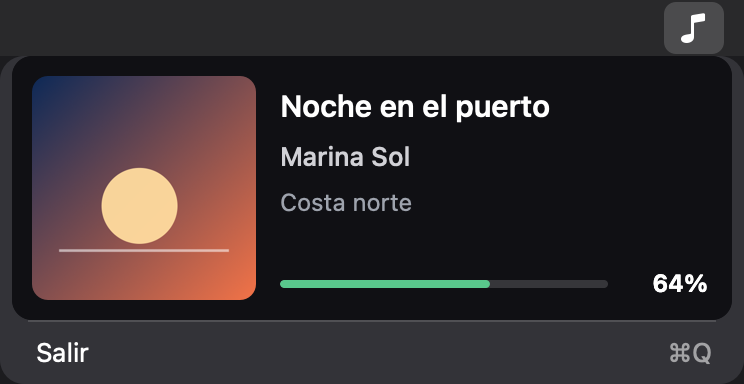 |

## Qué necesitas

- Un Mac con macOS y las Command Line Tools de Xcode (`xcode-select --install`). El desarrollo y las pruebas se han hecho en Apple Silicon con macOS 27. No hay versión para Windows ni Linux.
- La aplicación de escritorio de Spotify, la que responde a AppleScript. El reproductor del navegador no sirve.
- Un Royal Kludge RK-S98 conectado por **USB**, con la pantalla encendida. Esta versión no usa el modo Bluetooth ni el receptor de 2,4 GHz.
- El teclado que acepta la subida es el que macOS anuncia como `0x258A:0x022B`, producto «Gaming Keyboard», fabricante SINO WEALTH. Otras unidades S98 pueden anunciar otro PID. El comando `info` los lista, y la subida se detiene si no encuentra exactamente esa interfaz.

No hace falta una cuenta de desarrollador de Spotify, ni Homebrew, ni `sudo`. El proyecto no instala un driver y no sustituye el firmware.

## Ponerlo en marcha

Todo se ejecuta desde la raíz del repositorio.

### 1. Compilar y ejecutar las pruebas

```sh
sh tests/run.sh
```

Eso compila la utilidad en `.build/rk-s98` y corre las pruebas locales: descriptores, codificación de la imagen, render, lectura de Spotify y el modo simulado. Al terminar deja una vista de ejemplo en `.build/preview.png`.

Si `swiftc` no existe, instala las herramientas de línea de comandos y vuelve a lanzar el script.

### 2. Ver la pantalla sin conectar el teclado

```sh
.build/rk-s98 render --mock
open .build/preview.png
```

`render --mock` dibuja una pista de ejemplo y escribe `.build/preview.png`. No abre Spotify y no abre el teclado. Esta es esa imagen, ampliada:

<p>
  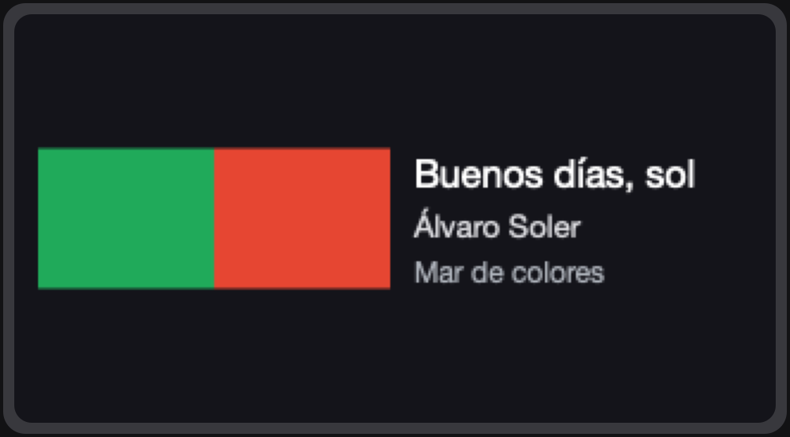
</p>

La carátula de ejemplo es más ancha que alta. El programa la encaja dentro del cuadrado y conserva la proporción, así que quedan bandas arriba y abajo. Una carátula cuadrada ocupa todo el hueco, como en la primera figura.

### 3. Comprobar que el teclado es el esperado

Con el S98 enchufado por USB:

```sh
.build/rk-s98 info
```

`info` lee datos que macOS ya tiene en el registro. No abre el teclado, no escucha teclas y no envía ningún informe HID. La salida es JSON. En la unidad de desarrollo aparecen dos servicios del fabricante `0x258A` y producto `0x022B`:

- uno es el teclado de arranque, con informes de entrada de 8 bytes;
- el otro admite un informe feature de hasta 1032 bytes. Por ahí viaja la imagen.

Por defecto el JSON omite número de serie, rutas del registro y ubicación USB. Aun así incluye los descriptores en hexadecimal: revísalo antes de pegarlo en una incidencia. `--include-identifiers` añade esos identificadores y solo hace falta para un diagnóstico local.

Si el PID no es `0x022B`, para aquí. La subida de este repositorio solo abre esa pareja VID/PID.

Para inspeccionar un descriptor ya guardado, sin el teclado:

```sh
.build/rk-s98 descriptor research/original-state/hid-report-descriptors/interface-1.bin
```

### 4. Leer Spotify

Abre la aplicación de escritorio, pon una pista en reproducción y ejecuta:

```sh
.build/rk-s98 spotify status
```

La primera vez macOS pregunta si la Terminal puede controlar Spotify. Hay que permitirlo en **Ajustes del Sistema → Privacidad y seguridad → Automatización**. La consulta no cambia la reproducción.

Con una pista activa la salida tiene esta forma:

```text
State: playing
Track: Noche en el puerto
Artist: Marina Sol
Album: Costa norte
Artwork: url
Track ID: spotify:track:…
```

Otros estados:

| Situación | Salida |
| --- | --- |
| Spotify cerrado | `State: unavailable` y `Spotify is not running` |
| Spotify abierto, sin pista | `State: stopped` y `No current track` |
| Pausa | `State: paused`, con título, artista y álbum |
| Sin carátula | `Artwork: missing` |

Los textos de este comando están en inglés. Los del menú están en español.

Para componer la pista real, otra vez sin abrir el teclado:

```sh
.build/rk-s98 render --spotify
open .build/preview.png
```

Si Spotify está cerrado o detenido, el comando no dibuja nada. Si la carátula no se puede descargar, avisa y dibuja el texto con una inicial en el hueco de la imagen.

### 5. Simular el envío

```sh
.build/rk-s98 daemon --dry-run --once
```

El modo `--dry-run` detecta la pista, compone la imagen y escribe en el registro cuántos informes enviaría. No transmite nada. Sin `--dry-run` o sin `--confirm-persistent-write`, el daemon se niega a arrancar.

`--once` hace un solo ciclo y termina. Sin esa opción repite la consulta. El intervalo mínimo es 1 segundo y el valor por defecto es 2:

```sh
.build/rk-s98 daemon --dry-run --interval 5
```

Detén ese proceso con Control-C. En ese modo el teclado no llega a abrirse.

### 6. Instalar la aplicación de la barra de menús

La aplicación de la barra **sí envía imágenes** al teclado, una cada vez que cambia la pista. Léelo en la sección siguiente antes de abrirla.

```sh
sh scripts/build-menu-app.sh
open "$HOME/Applications/RK S98.app"
```

El script compila `RK S98.app`, la copia en `~/Applications` y la firma en local con una firma ad hoc, suficiente para ejecutarla en ese Mac. La aplicación aparece en el Launchpad con este icono y no deja un icono fijo en el Dock.

<p>
  
</p>

Al abrirla no sale una ventana. Busca la nota musical en la barra de menús. La primera consulta a Spotify puede pedir permiso de Automatización, y la apertura del teclado puede pedir **Monitorización de entrada**. El sistema a veces trae la aplicación al frente solo para mostrar ese diálogo; después vuelve a quedarse en la barra.

**Salir** cierra la aplicación hasta la próxima vez que la abras. Si hay una subida a medias, espera a que termine. Una segunda copia no arranca: el proceso ya en marcha conserva el candado y la nueva sale al momento.

Esta copia no se añade sola a los ítems de inicio de sesión. Si quieres que arranque al entrar en tu cuenta, añádela tú desde Ajustes del Sistema.

Los registros, la caché de carátulas y la última pista enviada quedan en:

```text
~/Library/Application Support/RK-S98/
```

El registro de la barra es `menu.log`, dentro de esa carpeta.

### 7. Enviar una imagen de verdad

Cada envío guarda la imagen en el modo de imagen dinámica del teclado. En esta unidad, al desconectar y volver a conectar el USB reaparece el reloj, y la imagen sigue disponible si se elige otra vez desde el dial. Trátalo como un guardado: el programa manda una imagen por pista, no un vídeo.

Desde la terminal, el envío continuo es:

```sh
.build/rk-s98 daemon --confirm-persistent-write
```

Hace la misma subida que la aplicación de la barra. `--once` sube la pista actual y termina. Los dos modos se excluyen: o `--dry-run`, o `--confirm-persistent-write`.

La primera vez que el sistema deniegue la apertura, añade a Monitorización de entrada el programa que lanza el comando (Terminal, iTerm u otro) o la aplicación RK S98, y ábrelo de nuevo. Recompilar cambia la firma y macOS puede volver a pedir el permiso.

Hay un comando aparte para una sola imagen de color plano, también persistente:

```sh
.build/rk-s98 upload-solid blue --confirm-persistent-write
```

Los colores admitidos son `blue`, `green` y `white`. Hace falta `--confirm-persistent-write`. Pedir `red`, u omitir la confirmación, termina con un error. No hace falta para usar Spotify. Sustituye la imagen dinámica guardada.

## Cómo se ve en la TFT

El raster es el que usa el editor del RK Web Driver para el S98: 320×172, RGB565. La pantalla física recorta un poco las esquinas. Estas figuras están ampliadas tres veces.

| Pista con carátula cuadrada | Carátula apaisada |
| --- | --- |
|  | 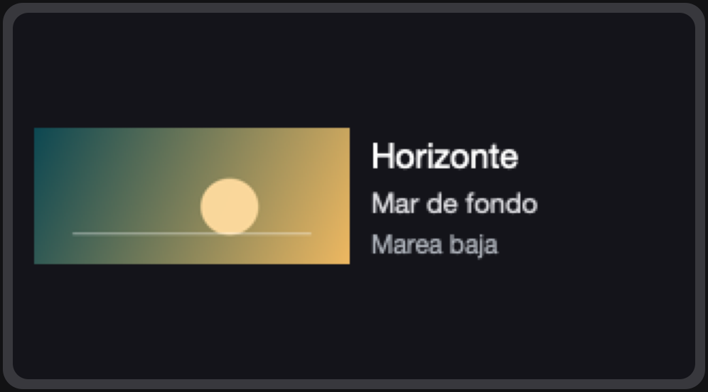 |

| Título largo | Sin carátula |
| --- | --- |
| 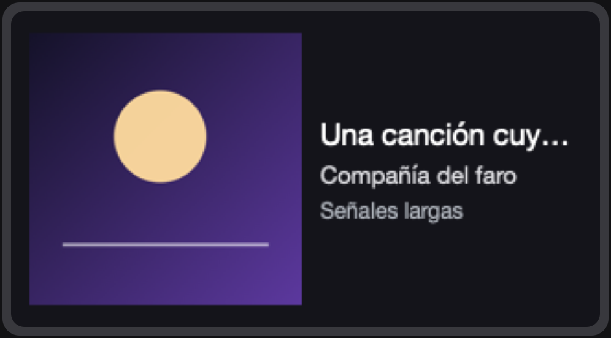 | 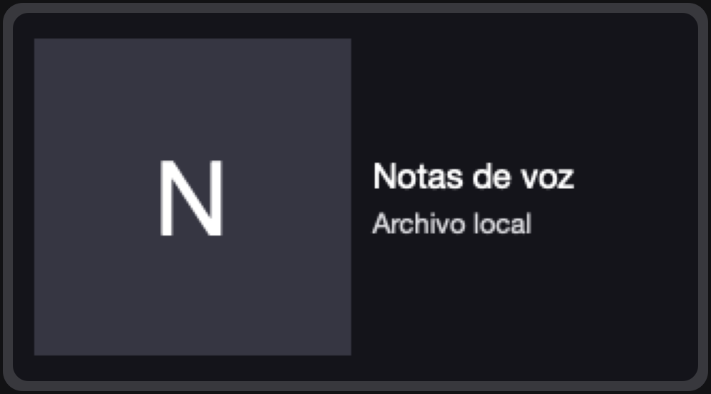 |

- El título que no cabe se corta con puntos suspensivos. En el menú, ese mismo texto se desplaza y, al pasar el cursor, se puede leer entero.
- Si falta el álbum, esa línea no se dibuja. Si falta la carátula, el hueco muestra la inicial del título.
- Acentos y eñes se dibujan. La pista de ejemplo del comando es «Buenos días, sol».
- Pausa y reproducción usan la misma imagen. El programa no vuelve a enviarla mientras no cambie la pista.
- Con Spotify cerrado o detenido no se envía una imagen nueva. La última queda en el teclado. El menú lo explica y no toca la pantalla.

| Teclado desconectado o no reconocido | Spotify cerrado |
| --- | --- |
| 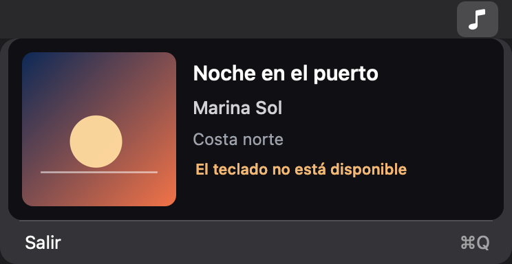 | 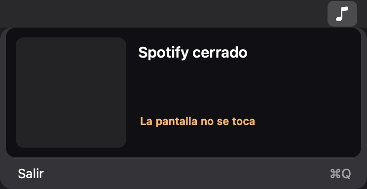 |

Otros avisos del menú: «Falta el permiso de monitorización», «No se ha podido subir» y «Se reintentará con la siguiente pista». Tras dos fallos con la misma pista, espera a que cambie la canción. Si el teclado no está, reintenta cada dos segundos, sin un bucle de informes.

## El dial y los menús del teclado

La aplicación no sustituye los menús del firmware y no detecta si el dial está abierto. En la unidad de desarrollo, con una imagen ya cargada, pulsar el dial tapó esa imagen con el menú nativo. Al salir sin confirmar un cambio, volvió la imagen, no el reloj.

<p>
  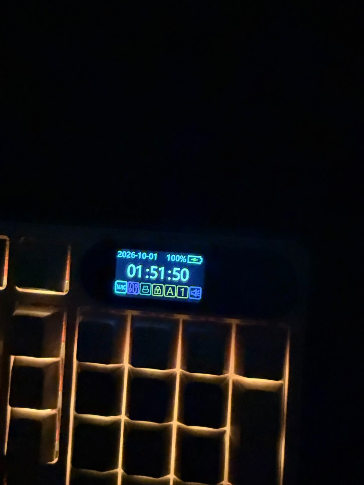
  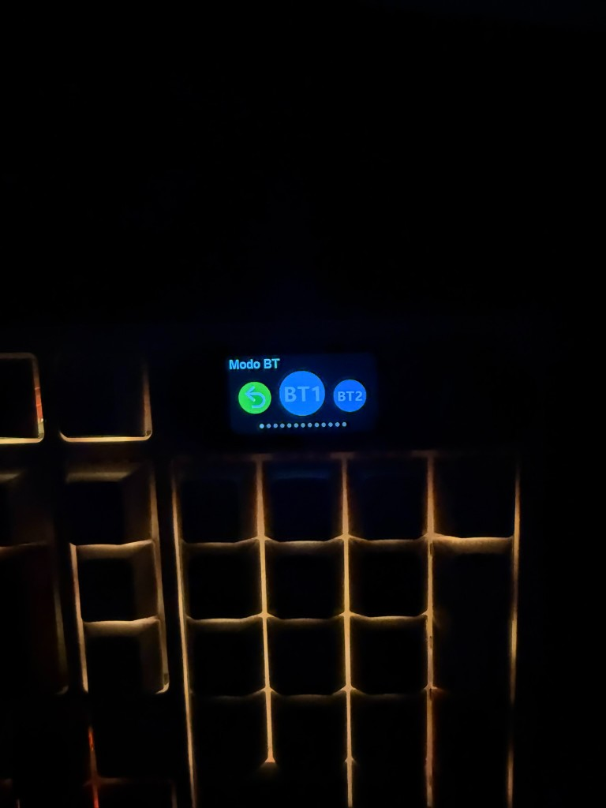
</p>

A la izquierda, el inicio con el reloj, antes de cargar una imagen. A la derecha, el menú «Modo BT» abierto con el dial mientras la imagen dinámica estaba activa.

Como el programa no sabe si ese menú está abierto, una pista que cambie en ese momento dispara otra subida. Conviene no saltar de canción mientras se usa el dial. La subida no es un chorro continuo: entre pista y pista la pantalla queda en manos del teclado.

Para volver al reloj en esta unidad bastó con desconectar y reconectar el USB. La imagen dinámica sigue guardada; el dial puede mostrarla otra vez. Escribir, el volumen y la luz de las teclas siguieron respondiendo después de la carga de prueba.

## Permisos

| Permiso | Cuándo | Quién debe tenerlo |
| --- | --- | --- |
| Automatización, para controlar Spotify | La primera consulta a Spotify | La Terminal, si usas los comandos; RK S98, si usas la barra |
| Monitorización de entrada | Al abrir el teclado para subir una imagen | El mismo programa que hace la subida |

`info`, `render --mock`, `render --spotify`, `spotify status` y `daemon --dry-run` no abren el teclado. La barra de menús, `daemon --confirm-persistent-write` y `upload-solid` sí.

El proyecto no guarda tokens, contraseñas ni el secreto de una aplicación de Spotify. No usa la Web API.

## Si algo sale mal

1. Cierra la aplicación con **Salir**, o detén el daemon con Control-C. Si estaba subiendo, deja que acabe ese envío.
2. Usa el dial para abrir un menú nativo y comprueba que el teclado sigue respondiendo.
3. Desconecta y vuelve a conectar el USB. En esta unidad el reloj regresó al hacerlo.
4. Si la imagen dinámica estorba, se puede sustituir desde el propio dial o, en una decisión aparte, desde el software oficial de RK. Conceder WebHID en el driver web no es una consulta pasiva: al elegir el dispositivo, ese software ya envía un informe.
5. El manual del RK-S98 describe un restablecimiento manteniendo Fn y espacio unos tres segundos. Aquí no se ha ejecutado. Déjalo como último recurso y asume que puede borrar preferencias.

No hace falta recuperar el firmware para salir de una prueba. El modo de actualización, el bootloader y DFU quedan fuera de este proyecto.

Si una subida falla, el programa no la repite en un bucle cerrado. Revisa `menu.log` o la salida de la terminal. Los mensajes útiles son «el teclado no está» (cable, pantalla apagada, otro PID o modo inalámbrico) y «permiso denegado» (Monitorización de entrada).

## Referencia de comandos

```text
rk-s98 info [--vid 0x258A] [--include-identifiers]
rk-s98 descriptor RUTA
rk-s98 render --mock [--output RUTA]
rk-s98 render --spotify [--output RUTA]
rk-s98 spotify status
rk-s98 daemon --dry-run [--once] [--interval SEGUNDOS]
rk-s98 daemon --confirm-persistent-write [--once] [--interval SEGUNDOS]
rk-s98 upload-solid blue|green|white --confirm-persistent-write
rk-s98 --help
```

| Comando | Toca el teclado |
| --- | --- |
| `info`, `descriptor`, `render`, `spotify status`, `daemon --dry-run` | No |
| `daemon --confirm-persistent-write`, `upload-solid`, la app RK S98 | Sí, y guarda la imagen dinámica |

La pista se identifica por el id de Spotify y la URL de la carátula. Si ambos vienen vacíos, se usan título, artista y álbum. La misma pista en pausa no genera otra subida. La carátula se guarda en disco y no se vuelve a descargar mientras la URL no cambie.

## Límites de esta versión

- Solo macOS, solo el cliente de escritorio de Spotify, solo USB.
- La subida está fijada a `0x258A:0x022B`. Otro PID se detecta con `info` y no recibe imágenes.
- No hay detección del menú del dial. Un cambio de pista durante el menú envía una imagen.
- No restaura el reloj al cerrar Spotify. En esta unidad el reloj volvió al reconectar el USB. Salir de un menú del dial devolvió la imagen dinámica, no el reloj.
- Cada pista nueva reescribe la imagen dinámica. No está medido cuántas escrituras admite esa memoria. Por eso no hay animación ni una subida periódica de la misma pista.
- El RGB, el mapa de teclas y el modo de conexión no se modifican a propósito. El proyecto no ofrece comandos para cambiarlos.
- Inalámbrico, Apple Music, la barra de progreso y el arranque automático quedan fuera de esta versión. La lectura de la pista está separada del teclado para poder añadir otra fuente más adelante.

## Mapa del repositorio

```text
src/cli/            comandos rk-s98
src/app/            daemon y barra de menús
src/spotify/        AppleScript del cliente de Spotify
src/display/        composición de los 320×172
src/keyboard/       descriptores, trama RGB565 y envío HID
scripts/            compilación de la app y figuras de este README
tests/              pruebas sin teclado físico
docs/images/        figuras del README
research/           inventario USB, protocolo y fotos de esta unidad
```

`scripts/render-readme-figures.swift` regenera las figuras de la pantalla y del menú. No abre el teclado.

Antes de un experimento físico nuevo, lee [AGENTS.md](AGENTS.md). El detalle de la unidad, del protocolo y de la recuperación está en [research/original-state/notes.md](research/original-state/notes.md), [research/protocol/rk-web-driver.md](research/protocol/rk-web-driver.md) y [research/notes/safety-and-recovery.md](research/notes/safety-and-recovery.md).
